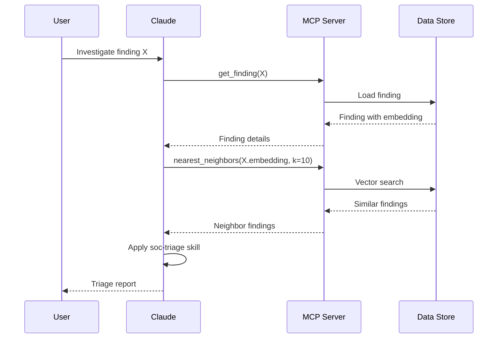

# Architecture

This document describes the architecture of the DeepTempo Embeddings-First AI SOC.

## Overview

The system follows a layered architecture that separates concerns between detection, reasoning, and orchestration:

```
┌─────────────────────────────────────────────────────────────────┐
│                        Claude (Orchestration)                    │
│  ┌─────────────┐ ┌─────────────┐ ┌─────────────┐ ┌─────────────┐│
│  │ soc-triage  │ │embedding-   │ │cross-signal-│ │attack-layer-││
│  │   skill     │ │hunt skill   │ │correlator   │ │exporter     ││
│  └─────────────┘ └─────────────┘ └─────────────┘ └─────────────┘│
└─────────────────────────────────────────────────────────────────┘
                              │
                              │ MCP Protocol
                              ▼
┌─────────────────────────────────────────────────────────────────┐
│                      MCP Server Layer                            │
│  ┌─────────────────┐ ┌─────────────────┐ ┌─────────────────┐    │
│  │ DeepTempo       │ │ Evidence        │ │ Case Store      │    │
│  │ Findings Server │ │ Snippets Server │ │ Server          │    │
│  └─────────────────┘ └─────────────────┘ └─────────────────┘    │
└─────────────────────────────────────────────────────────────────┘
                              │
                              ▼
┌─────────────────────────────────────────────────────────────────┐
│                      Data Layer (v0.1: JSON Files)               │
│  ┌─────────────┐ ┌─────────────┐ ┌─────────────┐                │
│  │ Findings    │ │ Evidence    │ │ Cases       │                │
│  │ Store       │ │ Store       │ │ Store       │                │
│  └─────────────┘ └─────────────┘ └─────────────┘                │
└─────────────────────────────────────────────────────────────────┘
                              │
                              ▼
┌─────────────────────────────────────────────────────────────────┐
│                      DeepTempo LogLM (Detection)                 │
│  ┌─────────────┐ ┌─────────────┐ ┌─────────────┐                │
│  │ Embeddings  │ │ Anomaly     │ │ MITRE       │                │
│  │ Generation  │ │ Detection   │ │ Classifier  │                │
│  └─────────────┘ └─────────────┘ └─────────────┘                │
└─────────────────────────────────────────────────────────────────┘
```

## Core Principles

### 1. Embeddings as the Primary Interface

Raw logs are treated as evidence-on-demand, not as the primary object of investigation. The LogLM transforms logs into semantic embeddings that:

- Capture behavioral patterns independent of specific log formats
- Enable similarity search across heterogeneous data sources
- Support clustering and anomaly detection
- Map to MITRE ATT&CK techniques

### 2. Separation of Detection and Reasoning

| Component | Responsibility |
|-----------|----------------|
| **DeepTempo LogLM** | Detection, embedding generation, MITRE classification |
| **Claude** | Reasoning, narrative generation, workflow orchestration |
| **MCP Servers** | Data access, filtering, aggregation |
| **Skills** | Task-specific workflows and prompts |

### 3. Least Privilege Data Access

The MCP servers implement tiered access:

- **Tier 1**: Embeddings, findings, aggregations (default)
- **Tier 2**: Evidence snippets with redaction (gated)
- **Tier 3**: Raw log export (disabled by default)

## Component Details

### Claude Skills

Skills are self-contained folders that teach Claude how to perform specific SOC tasks:

```
skills/
├── soc-triage/
│   ├── SKILL.md           # Skill definition and metadata
│   ├── instructions.md    # Detailed instructions
│   └── evals/             # Test cases
├── embedding-hunt/
├── cross-signal-correlator/
├── attack-layer-exporter/
└── response-recommender/
```

Each skill follows the [Anthropic Skills](https://github.com/anthropics/skills) conventions.

### MCP Servers

MCP (Model Context Protocol) servers expose tools and resources to Claude:

#### DeepTempo Findings Server

Primary server for accessing findings and embeddings:

- `get_finding(finding_id)` - Retrieve a single finding
- `nearest_neighbors(query, k, filters)` - Similarity search
- `technique_rollup(time_window, scope)` - MITRE aggregation
- `cluster_summary(cluster_id)` - Behavior cluster details

#### Evidence Snippets Server

Gated access to raw log evidence:

- `evidence_snippets(finding_id, max_lines, redaction)` - Get log snippets
- Implements PII redaction by default
- Rate limited and audited

#### Case Store Server

Case management for investigations:

- `create_case(finding_ids, title, description)` - Create new case
- `update_case(case_id, updates)` - Update case status
- `get_case(case_id)` - Retrieve case details
- `list_cases(filters)` - List cases with filtering

### Data Storage (v0.1)

The simplified v0.1 uses JSON files for storage:

```
data/
├── findings/
│   └── findings.json      # All findings with embeddings
├── evidence/
│   ├── flow/              # Flow log snippets
│   ├── dns/               # DNS log snippets
│   └── waf/               # WAF log snippets
└── cases/
    └── cases.json         # Investigation cases
```

### Vector Search (v0.1)

For the simplified implementation, we use numpy for cosine similarity:

```python
import numpy as np

def cosine_similarity(a: np.ndarray, b: np.ndarray) -> float:
    return np.dot(a, b) / (np.linalg.norm(a) * np.linalg.norm(b))

def nearest_neighbors(query_embedding: list, findings: list, k: int = 10) -> list:
    query = np.array(query_embedding)
    scores = []
    for finding in findings:
        embedding = np.array(finding["embedding"])
        score = cosine_similarity(query, embedding)
        scores.append((finding, score))
    scores.sort(key=lambda x: x[1], reverse=True)
    return scores[:k]
```

## Data Flow

### Investigation Workflow

1. **Finding Ingestion**: DeepTempo exports findings with embeddings
2. **Loading**: Adapter loads findings into JSON store
3. **Query**: Claude invokes MCP tools to search/filter findings
4. **Analysis**: Skills guide Claude through investigation steps
5. **Evidence**: Gated access to raw logs when needed
6. **Output**: Triage reports, ATT&CK layers, response recommendations

### Example: Triage Workflow



## Future Architecture (v1+)

### Production Storage

Replace JSON files with:

- **PostgreSQL + pgvector**: For findings and vector search
- **Redis**: For caching and session state
- **S3/MinIO**: For raw log evidence

### Scalability

- Horizontal scaling of MCP servers
- Connection pooling for database
- Async processing for large queries

### Security Enhancements

- OAuth2/OIDC authentication
- Role-based access control
- Audit logging to SIEM
- Encryption at rest and in transit
